# Azure IAM Hardening with Microsoft Entra ID

## Overview
This project implements **Identity and Access Management (IAM) hardening** using Microsoft Entra ID (formerly Azure Active Directory). Identity is the #1 attack surface in cloud — over 80% of breaches involve compromised credentials. This project demonstrates how to secure identities using least privilege, MFA enforcement, and identity monitoring.

## Architecture

Default Directory (fritzlearninghotmail.onmicrosoft.com)
├── Users
│   ├── Admin: fritzlearning@hotmail.com (Owner)
│   └── TestUser-Security (Reader - least privilege)
├── Groups
│   └── Security-Analysts (RBAC: Reader role)
├── RBAC Role Assignments
│   ├── Owner → Admin user
│   └── Reader → Security-Analysts group
├── Security Defaults (MFA enforcement)
└── App Registrations
└── SecurityApp-IAM-Project
└── Client Secret: IAM-Project-Secret

## What I Built

- **Test User** with least privilege access
- **Security Group** for role-based access management
- **RBAC Reader Role** assigned to Security-Analysts group
- **Security Defaults** enforcing MFA across the tenant
- **App Registration** simulating application authentication
- **Client Secret** for secure app identity
- **Sign-in monitoring** via Entra ID logs
- **IAM testing** — verified read access and blocked write access

## Security Controls Implemented

| Control | Implementation |
|---------|---------------|
| Least Privilege | Reader role — view only, no create/delete |
| MFA Enforcement | Security Defaults enabled across tenant |
| Group-Based Access | RBAC assigned to group not individual |
| App Authentication | App registration with client secret |
| Identity Monitoring | Sign-in logs tracking all user activity |
| Zero Standing Access | TestUser has no admin rights |

## IAM Testing Results

| Test | Expected | Result |
|------|----------|--------|
| TestUser login | MFA prompted | ✅ MFA enforced |
| View resource group | Should succeed | ✅ All resources visible |
| Create resource | Should be blocked | ✅ Authorization failed |
| Sign-in monitoring | Logs captured | ✅ All sign-ins recorded |

## Screenshots

### Entra ID Overview
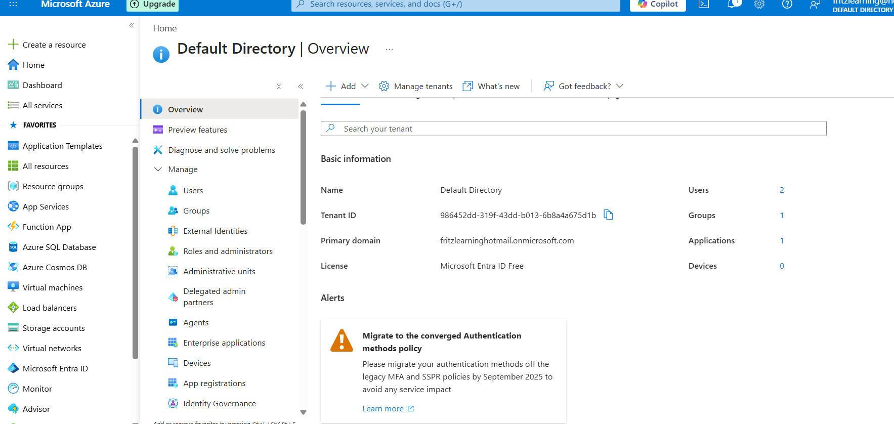

### Test User Created
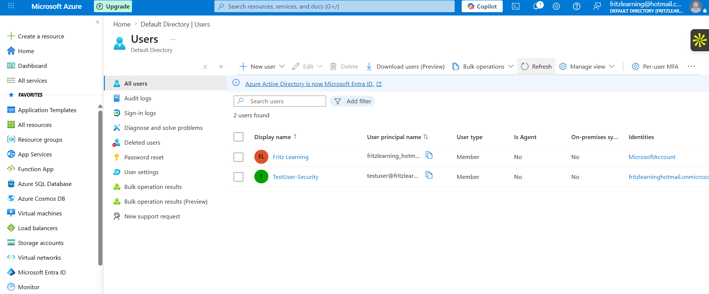

### Security Group
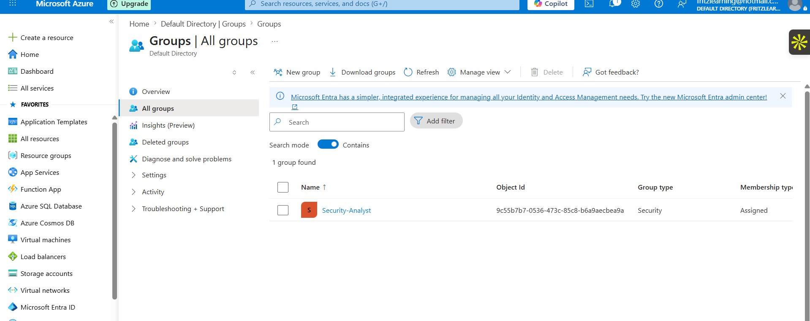

### RBAC Reader Role Assigned
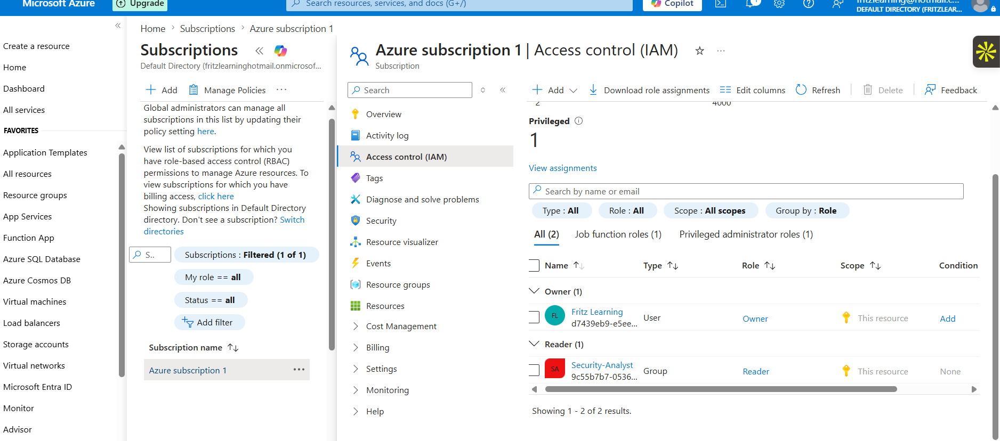

### Security Defaults Enabled
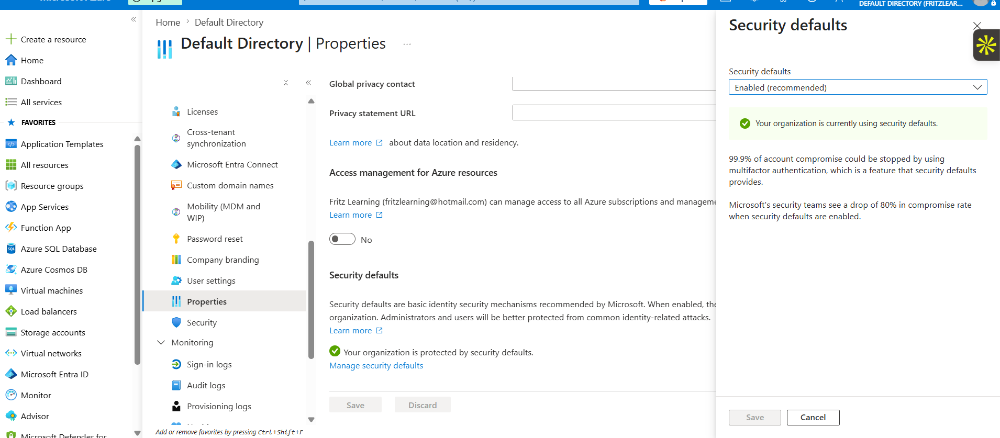

### App Registration
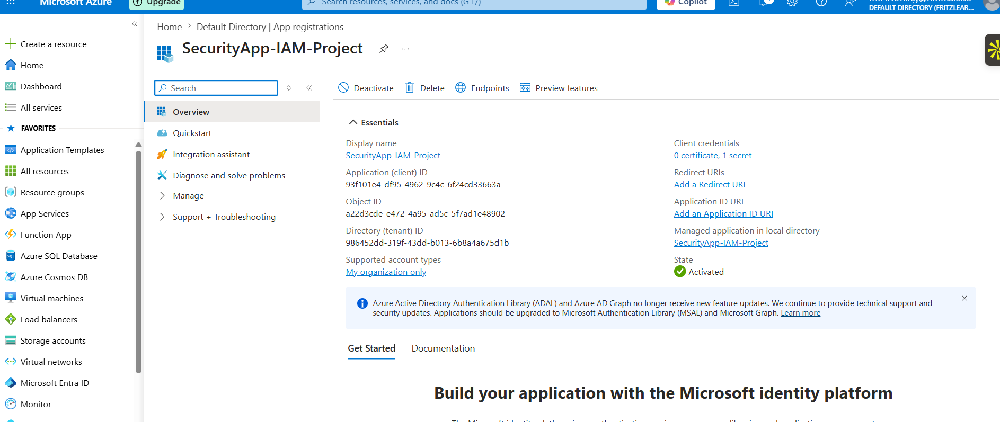

### Client Secret
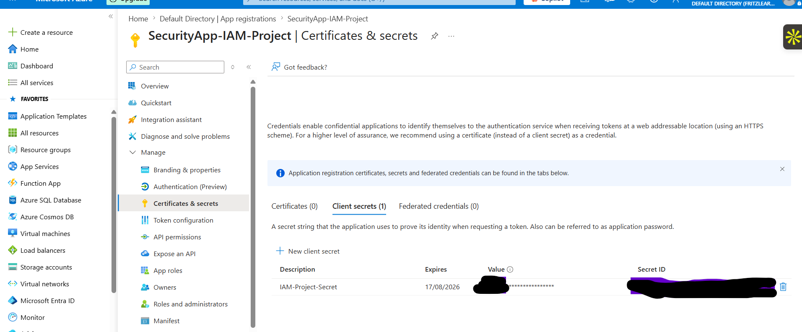

### Sign-in Logs
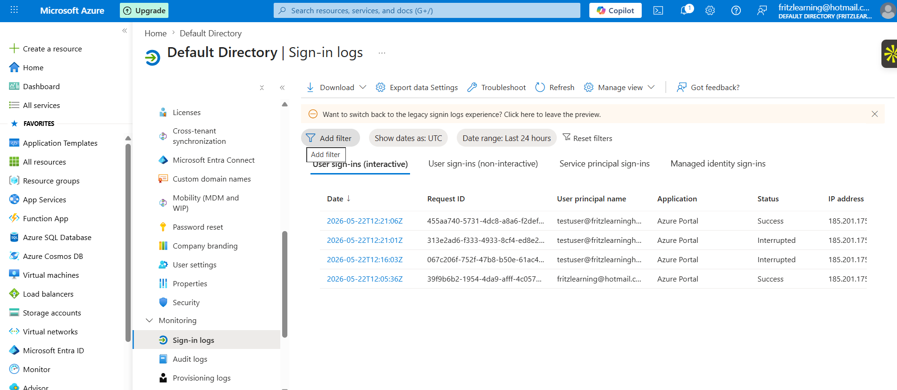

### TestUser Dashboard (Restricted)
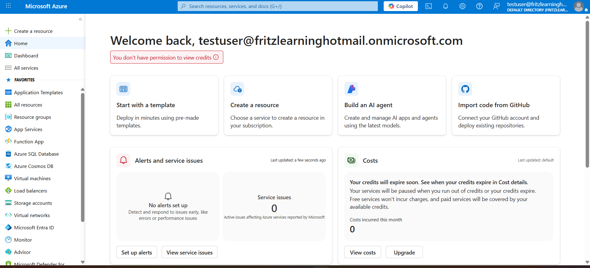

### Reader Can View Resources
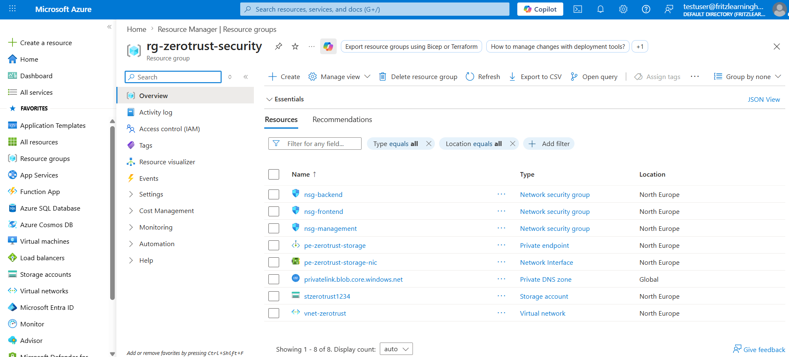

### RBAC Blocks Resource Creation
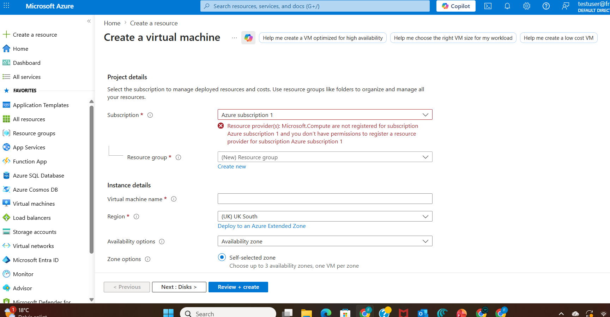

## Technologies Used
- Microsoft Entra ID (Azure Active Directory)
- Azure Role-Based Access Control (RBAC)
- Microsoft Security Defaults
- Azure App Registrations
- OAuth 2.0 / Client Credentials
- Azure Monitor — Sign-in Logs

## Key Learnings
- Identity is the #1 attack surface in cloud environments
- Group-based RBAC is more scalable than individual assignments
- Security Defaults provide free MFA enforcement for all users
- App registrations enable secure service-to-service authentication
- Sign-in logs are essential for detecting suspicious activity
- Least privilege means giving minimum access needed — nothing more

## Related Projects
- Project 1: [Zero Trust Network Security](https://github.com/fritzekane/azure-zerotrust-network-security)
- Project 3: [Security Monitoring with Microsoft Sentinel](coming soon)
- Project 4: [Compliance Automation with Azure Policy](coming soon)

---
*Part of my Azure Cloud Security Portfolio — 7 hands-on projects demonstrating real-world security engineering skills.*
